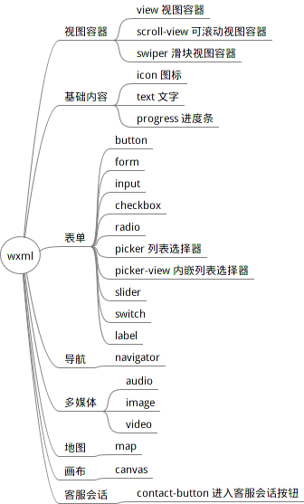

# miniApp
微信小程序
1. github建仓库
2. vscode下载版本
3. 使用wechat_devtools创建框架
4. vscode修改代码
5. wechat_devtools上传代码

## 学习笔记
### 文档结构

小程序包含一个描述整体程序的 app 和多个描述各自页面的 page。
一个小程序主体部分由三个文件组成，必须放在项目的根目录，如下：
文件	|   必填	|   作用
------|---------|-----------
app.js	|   是	|   小程序逻辑
app.json    |	是	|   小程序公共设置
app.wxss	|   否	|   小程序公共样式表

一个框架页面由四个文件组成，分别是：
文件类型    |   必填	|   作用
------  |--------|-----
js	    |   是	|   页面逻辑
wxml	|   是	|   页面结构
wxss	|   否	|   页面样式表
json	|   否	|   页面配置

### 配置
app.json对微信进行全局配置
```
{
  "pages": [
    "pages/index/index",
    "pages/logs/index"
  ],  
"window": {
    "navigationBarTitleText": "Demo"
  },
  "tabBar": {
    "list": [{
      "pagePath": "pages/index/index",
      "text": "首页"
    }, {
      "pagePath": "pages/logs/logs",
      "text": "日志"
    }]
  },
  "networkTimeout": {
    "request": 10000,
    "downloadFile": 10000
  },
  "debug": true
}
```
* pages  |  小程序页面个数和路径
* window    |   小程序窗口效果
* tabBar    |   导航条设置
* networkTimeout    |   网络响应超时设置
* debug     |   调试设置

pages内的json文件只能设置当前page的window，所以不需要window标签。

### 小程序开发逻辑层
javaScript语言实现。
微信js相对于js的修改
* 增加了App和Page方法，进行程序和page的注册
* 提供丰富的API
* 每个页面有独立的作用域，并提供模块化能力
* 所有js代码最终上传时会被打包为一个js

#### App() 函数
用来注册一个小程序，将诶收一个object参数，其指定小程序的生命周期函数等
object参数说明:

#### Page() 函数

##page页面结构
### wxml语法
wxml(weixin markup language)是框架设计的一套标签语言，结合基础组件、时间系统，可以构建出页面的结构。

* 数据绑定
```
<!--wxml-->
<view> {{message}} </view>
```
```
// page.js
Page({
  data: {
    message: 'Hello MINA!'
  }
})
```
* 列表渲染
```
<!--wxml-->
<view wx:for="{{array}}"> {{item}} </view>
```
```
// page.js
Page({
  data: {
    array: [1, 2, 3, 4, 5]
  }
})
```
* 条件渲染
```
<!--wxml-->
<view wx:if="{{view == 'WEBVIEW'}}"> WEBVIEW1 </view>
<view wx:elif="{{view == 'APP'}}"> APP1 </view>
<view wx:else> MINA1 </view>
```
```
// page.js
Page({
  data: {
    view: 'APP'
  }
})
```
* 模板
* 事件
* 引用

### 基础组件

### 事件系统